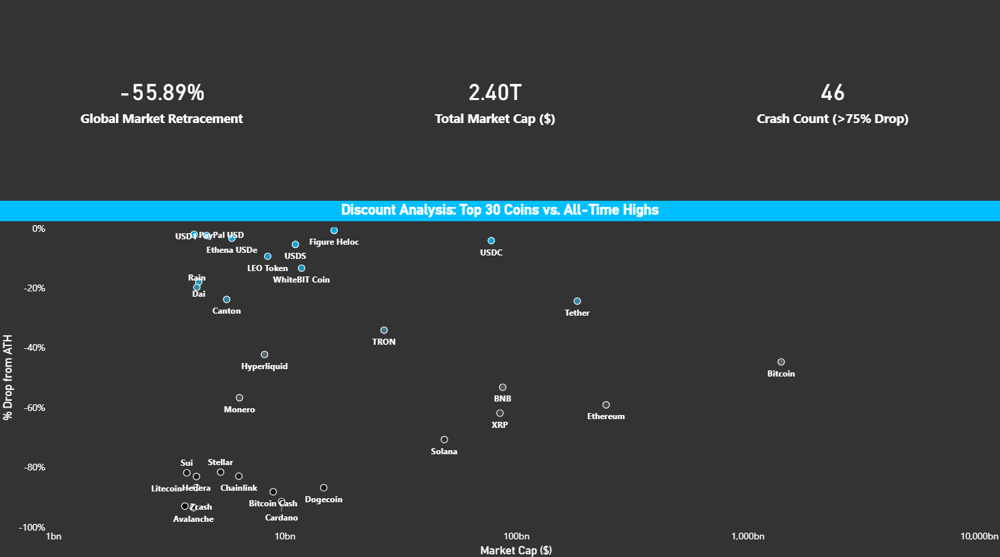

# Crypto Market Analysis Dashboard

Power BI dashboard analyzing the cryptocurrency market using live API data.

## Project Overview

This project analyzes the current state of the cryptocurrency market by comparing the top coins against their all-time highs.

The dashboard highlights market retracement, market capitalization distribution, and identifies coins that have experienced major price crashes.

## Key Features

• API-based cryptocurrency data ingestion  
• Global market retracement analysis  
• Market capitalization analysis of top coins  
• Scatter plot comparing market cap vs. drop from all-time high  
• Crash statistics for coins with >75% decline  

## Tools & Technologies

• Power BI  
• API data source  
• DAX calculations  
• Power Query (data transformation)

## Insights

The visualization reveals that even large-cap cryptocurrencies have experienced significant drawdowns from their all-time highs, while smaller-cap assets show more extreme volatility.
